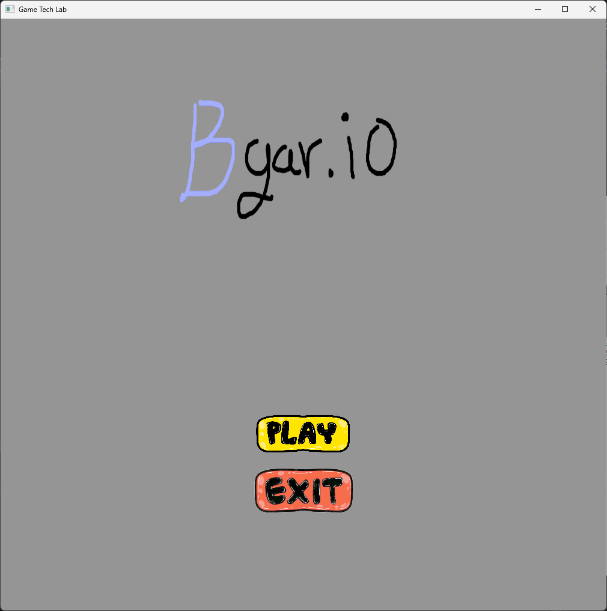
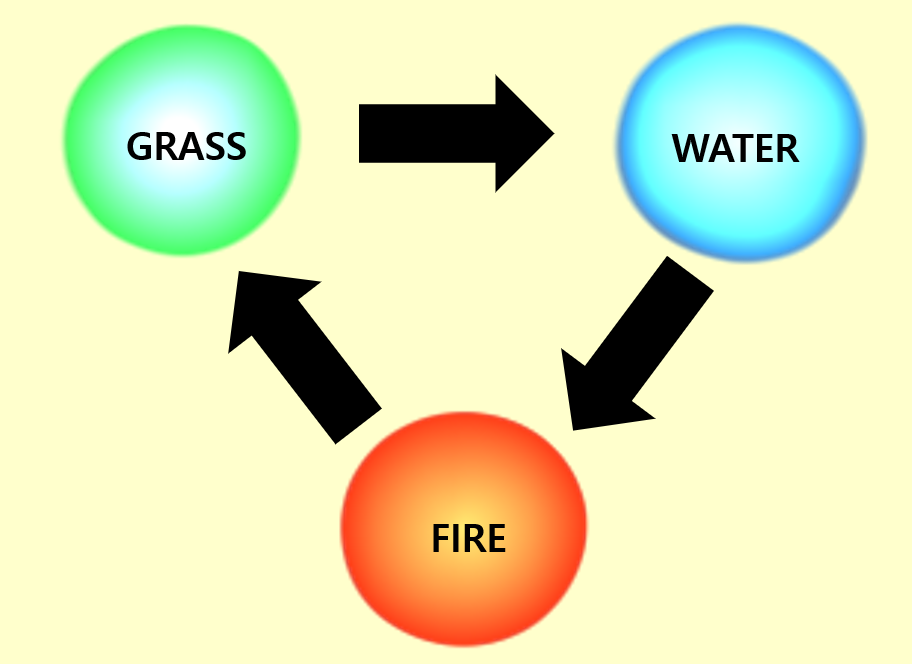
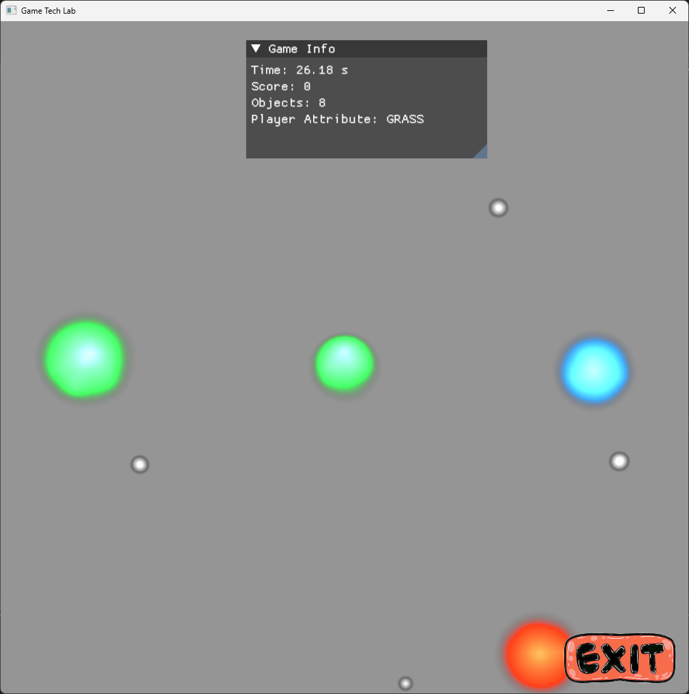
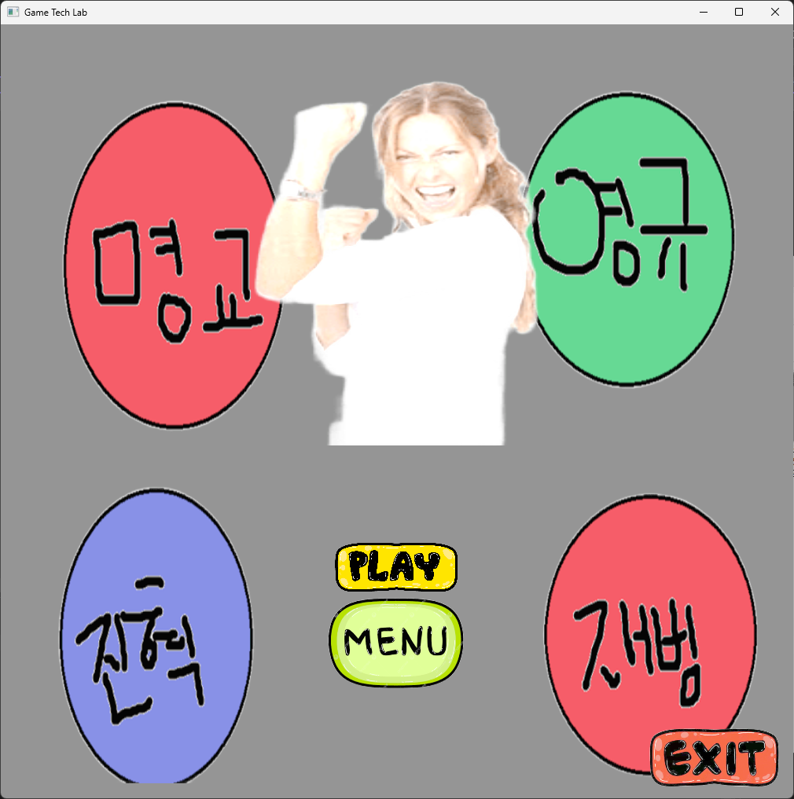
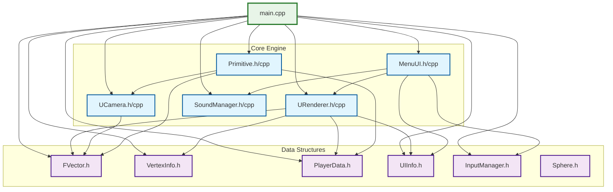

# Bgar.io

Agar.io에서 영감을 받아 제작된 세포 진화 게임으로, DirectX 11과 ImGui를 사용하여 실시간 3D 그래픽과 인터랙티브 UI를 제공합니다.



## 개요

Bgar.io는 Agar.io의 핵심 게임플레이에 속성 기반 전투 시스템과 30초 타임어택을 추가한 혁신적인 세포 진화 게임입니다. DirectX 11을 사용한 하드웨어 가속 그래픽 렌더링과 ImGui 기반의 직관적인 UI로 구현되었습니다. 플레이어는 제한된 시간 내에 다양한 속성을 가진 세포를 조작하여 성장하고 최고 점수를 달성해야 합니다.

## 게임 특징

### 🎮 핵심 게임플레이
- **세포 진화 시스템**: Agar.io 스타일의 세포 성장 및 진화
- **속성 기반 전투**: 불 🔥, 물 💧, 풀 🌿 속성을 활용한 가위바위보 시스템
- **전략적 배틀**: 속성 상성을 이용한 전술적 게임플레이
- **30초 타임어택**: 제한된 시간 내에 최대한 많은 점수 획득

### 🔥💧🌿 속성 시스템
- **불 속성 (Fire)**: 풀 속성에 강하고, 물 속성에 약함
- **물 속성 (Water)**: 불 속성에 강하고, 풀 속성에 약함  
- **풀 속성 (Plant)**: 물 속성에 강하고, 불 속성에 약함
- **무속성 (Neutral)**: 모든 속성 세포가 먹을 수 있는 기본 먹이



### 🛠️ 기술적 기능
- **DirectX 11 렌더링**: 부드러운 3D 그래픽과 시각 효과
- **ImGui 통합**: 직관적인 게임 UI 및 실시간 정보 표시
- **사운드 시스템**: 몰입감 있는 배경음악과 효과음
- **입력 시스템**: 정밀한 마우스 컨트롤과 키보드 단축키
- **카메라 시스템**: 동적 시점 추적 및 줌 기능
- **실시간 UI**: 점수, 속성 정보, 게임 상태 실시간 업데이트

## 프로젝트 구조

```
Engine/
├── main.cpp              # 애플리케이션 진입점
├── MenuUI.h/.cpp         # 게임 메뉴 시스템
├── UIInfo.h/.cpp         # UI 정보 표시
├── InputManager.h/.cpp   # 입력 처리 시스템
├── SoundManager.h/.cpp   # 오디오 관리
├── URenderer.h/.cpp      # 렌더링 시스템
├── UCamera.h/.cpp        # 카메라 제어 시스템
├── PlayerData.h/.cpp     # 플레이어 상태 관리
├── Primitive.h/.cpp      # 기본 도형 렌더링
├── Sphere.h/.cpp         # 구 프리미티브 구현
├── FVector.h/.cpp        # 3D 벡터 수학
├── VertexInfo.h          # 버텍스 데이터 구조
└── ImGui/                # ImGui 라이브러리 통합
```

## 시스템 요구사항

- **운영체제**: Windows 10/11
- **개발 환경**: Visual Studio 2022
- **그래픽 API**: DirectX 11
- **빌드 플랫폼**: x64/x86

## 프로젝트 빌드

1. Visual Studio 2022에서 `Engine.sln` 파일을 엽니다
2. 원하는 구성을 선택합니다:
   - Debug x64 (개발용 권장)
   - Release x64 (성능용 권장)
   - Debug x86
   - Release x86
3. 솔루션을 빌드합니다 (Ctrl+Shift+B)

## 구성 옵션

프로젝트는 여러 빌드 구성을 지원합니다:
- **Debug**: 디버깅 심볼이 포함된 개발 빌드
- **Release**: 성능을 위한 최적화된 빌드
- **x64**: 64비트 대상 플랫폼
- **x86**: 32비트 대상 플랫폼

## 종속성

- **DirectX 11**: 그래픽 렌더링 API
- **ImGui**: 즉시 모드 GUI 라이브러리 (포함됨)
- **Windows API**: 시스템 통합 및 창 관리

## 라이선스

이 프로젝트는 MIT 라이선스 하에 라이선스가 부여됩니다. 자세한 내용은 [LICENSE](LICENSE) 파일을 참조하세요.

## 게임플레이 가이드

### 기본 조작법
- **이동**: 마우스로 세포 이동 방향 제어
- **먹이 흡수**: 세포나 먹이에 접촉하여 성장
- **속성 변경**: 특정 키로 세포 속성 전환 (게임 내 안내 참조)



### 전략 가이드
1. **시간 관리**: 30초 안에 최대한 많은 점수를 얻는 것이 목표
2. **속성 상성 활용**: 상대 세포의 속성을 파악하고 유리한 속성으로 변경
3. **무속성 먹이 활용**: 초반에는 안전한 무속성 먹이로 빠르게 성장
4. **효율적 이동**: 시간이 제한되어 있으므로 효율적인 경로 선택이 중요
5. **타겟 우선순위**: 자신보다 작은 세포나 유리한 속성 상성의 세포를 우선 공격



## 개발 정보

### 게임 엔진 아키텍처
Bgar.io는 커스텀 C++ 게임 엔진을 기반으로 구축되어 최적화된 성능과 부드러운 게임플레이를 제공합니다.



## 최근 업데이트

- 시간 및 점수 UI 개선
- 게임 오버 로직 수정  
- 속성 시스템 밸런싱
- 세포 렌더링 시스템 최적화
- 실시간 배틀 시스템 구현

## 저작권

Copyright (c) 2025 GameTithe

---

*Agar.io에서 영감을 받아 속성 기반 전투 시스템을 추가한 혁신적인 세포 진화 게임*